# Table of Contents

1. [Exercise 1](#exercise-1)
2. [Exercise 2](#exercise-2)
3. [Exercise 3](#exercise-3)
4. [Exercise 4 Part 1](#exercise-4-part-1)
5. [Exercise 4 Part 2](#exercise-4-part-2)
6. [Exercise 4 Part 3](#exercise-4-part-3)
7. [Exercise 5](#exercise-5)
8. [Exercise 6 Part 1](#exercise-6-part-1)
9. [Exercise 6 Part 2](#exercise-6-part-2)
10. [Exercise 6 Part 3](#exercise-6-part-3)
11. [Exercise 6 Part 4](#exercise-6-part-4)
12. [Exercise 6 Part 5](#exercise-6-part-5)
13. [Exercise 6 part 6](#exercise-6-part-6)
14. [Exercise 6 Part 7](#exercise-6-part-7)

# Exercise 1

## Table of Contents

1. [Install Python](#install-python)
2. [Set Up a Virtual Environment](#set-up-a-virtual-environment)
3. [Create a Python Script](#create-a-python-script)
4. [Set Up IPython Shell](#set-up-ipython-shell)
5. [Export a Requirements File](#export-a-requirements-file)
6. [Create a Github Repo](#create-a-github-repo)

## Install Python

First, install Python 3.11.5 on your system. Check your Python version by using the command `python --version` from your terminal.


## Set Up a Virtual Environment

Set up a new virtual environment named “cf-python-base”.


## Create a Python Script

Install Visual Studio Code or another text editor of your choice and create a Python script named “add.py”. This script will take two numbers from the user input, add them, and print the result. Here's the template for your Python script:


```python
# Prompt the user to enter the first number
a = int(input("Enter the first number: "))

# Prompt the user to enter the second number
b = int(input("Enter the second number: "))

# Add the two numbers and store the result in variable c
c = a + b

# Print the value of c
print("The sum of", a, "and", b, "is:", c)
```

## Set Up IPython Shell

Set up an IPython shell in the virtual environment "cf-python-base". An IPython shell is similar to the regular Python REPL with additional features like syntax highlighting, auto-indentation, and robust auto-complete features. Install it using pip.


## Export a Requirements File

Generate a “requirements.txt” file from your source environment. Next, create a new environment called “cf-python-copy”. In this new environment, install packages from the “requirements.txt” file.


# Exercise 2

## Table of Contents

1. [Create the Data Structure](#create-the-data-structure)
2. [Create recipe_1](#create-recipe_1)
3. [Create Outer Structure](#create-outer-structure)
4. [Create 4 More Recipes](#create-4-more-recipes)
5. [Print Ingredient Lists](#print-ingredient-lists)

## Create the Data Structure

- Create a structure named recipe_1 that contains the following keys:
  - name (str): Contains the name of the recipe
  - cooking_time (int): Contains the cooking time in minutes
  - ingredients (list): Contains a number of ingredients, each of the str data type


_For this use case, a dictionary will be most suitable as it provides a key-value structure to associate recipe attributes. It allows easy access to specific information using keys. Dictionaries can support different data types by accommodating strings, integers, and lists for recipe name, cooking time, and ingredients, respectively. This structure will maintain organization and consistency, which is particularly useful when storing multiple recipes in a container such as a list._

## Create recipe_1


## Create outer Structure

Create an outer structure called all_recipes, and then add recipe_1 to it.


_Using a list provides a dynamic structure, allowing easy modification and retrieval of recipes based on their order. Lists support iteration and indexing, enabling convenient operations on individual recipes or the entire collection. The versatility of lists accommodates recipes of varying lengths and complexities, making it suitable for a diverse range of recipe structures. Overall, a list provides the flexibility, scalability, and ease of access required for managing and modifying multiple recipes._

## Create 4 More Recipes

Generate 4 more recipes as recipe_2, recipe_3, recipe_4, and recipe_5, and then add them as well to all_recipes.


## Print Ingredient Lists

Print the ingredients of each recipe as five different lists, inside the IPython shell.


# Exercise 3

## Table of Contents

1. [Create a New Python Script](#create-a-new-python-script)
2. [Initialize Two Empty Lists](#initialize-two-empty-lists)
3. [Define a Function](#define-a-function)
4. [Get The Number of New Recipes](#get-the-number-of-new-recipes)
5. [Check Ingredients and Add Recipes](#check-ingredients-and-add-recipes)
6. [Assign Difficulty Levels and Display Recipes](#assign-difficulty-levles-and-display-recipes)
7. [Display All Ingredients](#display-all-ingredients)

## Create a New Python Script

Open a Python script in an editor of your choice and name it “Exercise_1.3.py”.


## Initialize Two Empty Lists

Initialize two empty lists: recipes_list and ingredients_list.


## Define a Function

Define a function called `take_recipe`, which takes input from the user for the following variables:

- `name` (str): Stores the name of the recipe.
- `cooking_time` (int): Stores the cooking time (in minutes).
- `ingredients` (list): A list that stores ingredients, each of the string data type.
- `recipe` (dictionary): Stores the `name`, `cooking_time`, and `ingredients` variables (e.g., `recipe = {'name': name, 'cooking_time': cooking_time, 'ingredients': ingredients}`).


## Get the Number of New Recipes

Ask the user how many recipes they would like to enter. Their response will be linked to a variable n.


## Check Ingredients and Add Recipes

Run a for loop, which runs n times to perform the following steps:

- Run `take_recipe()` and store its return output (a dictionary) in a variable called **recipe**.
- Run another for loop inside this loop, which iterates through recipe’s ingredients list, where it picks out elements one-by-one as ingredient. It will run the following step inside: if the chosen ingredient isn’t present in ingredients_list, add it to this list.
- Once finished adding ingredients, append recipe to recipes_list.


## Assign Difficulty Levels and Display Recipes

Run another for loop that iterates through the recipes_list and assign a difficulty level based on the following criteria:

- If cooking_time is less than 10 minutes, and the number of ingredients is less than 4, set a variable called difficulty to the value of **Easy**.
- If cooking_time is less than 10 minutes, and the number of ingredients is greater than or equal to 4, set a variable called difficulty to the value of **Medium**.
- If cooking_time is greater than or equal to 10 minutes, and the number of ingredients is less than 4, set a variable called difficulty to the value of **Intermediate**.
- If cooking_time is greater than or equal to 10 minutes, and the number of ingredients is greater than or equal to 4, set a variable called difficulty to the value of **Hard**.

Display each recipe in the following format:

- Recipe:
- Cooking Time (min):
- Ingredients:
- Difficulty level:


## Display All Ingredients

Display all the ingredients that you’ve come across so far in all of the recipes that you’ve entered.


# Exercise 4 Part 1

## Table of Contents

1. [Import Pickle Module](#import-pickle-module)
2. [Define the Take Recipe Function](#define-the-take-recipe-function)
3. [Define the Calc Difficulty Function](#define-the-calc-difficulty-function)
4. [Try To Open a File](#try-to-open-a-file)
5. [Take Additional Recipes](#take-additional-recipes)
6. [Create the Data Dictionary](#create-the-data-dictionary)
7. [Save Data to a File](#save-data-to-a-file)

## Import Pickle Module


## Define the Take Recipe Function

Define a function called `take_recipe()` to take recipes from the user, which performs the following operations:

- Taking in the recipe name, cooking time, and ingredients from the user.
- Calculating the difficulty of the recipe by calling the `calc_difficulty()` function.
- Gathering all these attributes into a dictionary and returning it.


## Define the Calc Difficulty Function

Define the function `calc_difficulty()`, where the difficulty is returned as **Easy**, **Medium**, **Intermediate** or **Hard** based on the following logic:

- If cooking_time is less than 10 minutes and the number of ingredients is less than 4, set a variable called difficulty to the value of **Easy**.
- If cooking_time is less than 10 minutes and the number of ingredients is greater than or equal to 4, set a variable called difficulty to **Medium**.
- If cooking_time is greater than or equal to 10 minutes and the number of ingredients is less than 4, set a variable called difficulty to the value of **Intermediate**.
- If cooking_time is greater than or equal to 10 minutes and the number of ingredients is greater than or equal to 4, set a variable called difficulty to **Hard**.


## Try To Open a File

Have a user enter a filename which would attempt to open a binary file in read mode, then define a try-except-else-finally block as follows:

- The **try** block will open the given file, and load its contents through the pickle module into a variable called data. The incoming data is expected to be a dictionary containing two key-value pairs:
  - recipes_list (a list of all recipes)
  - all_ingredients (a list of all ingredients across all recipes)
- An **except** clause handles the FileNotFoundError exception if a file with the given name isn’t found. The code block after will create a new dictionary called data, which contains the recipes list under the key recipes_list and another list containing all the ingredients under all_ingredients.
- Another **except** clause that handles other exceptions and performs the same operations as the first except block.
- An **else** block that closes the file stream that would’ve been opened in the try block.
- A **finally** block that extracts the values from the dictionary into two separate lists: recipes_list and all_ingredients.


## Take Additional Recipes

Ask the user how many recipes they’d like to enter, and define a for loop that calls the `take_recipe()` function. Append the output of this function into **recipes_list**. Next, define an inner loop that scans through the recipe’s ingredients and adds them to **all_ingredients** if they’re not already there.


## Create the Data Dictionary

Gather the updated `recipes_list` and `all_ingredients` into the dictionary called **data**.


## Save Data to a File

Open a user-defined binary file and write `data` to it using the pickle module.


# Exercise 4 Part 2

## Table of Contents

1. [Import the Pickle Module](#import-the-pickle-module)
2. [Define the Display Recipe Function](#define-the-display-recipe-function)
3. [Define the Search Ingredient Function](#define-the-search-ingredient-function)
4. [Ask User for Recipe File](#ask-user-for-recipe-file)
5. [Try To Open User File](#try-to-open-user-file)
6. [Create Except Block](#create-except-block)
7. [Create Else Block](#create-else-block)

## Import the Pickle Module

Import the pickle module:


## Define the Display Recipe Function

The function should take in one recipe (of the dictionary type) as an argument and print all of its attributes including the recipe name, cooking time, ingredients, and difficulty.


## Define the Search Ingredient Function

The function takes in a dictionary called data as its argument. The function will perform the following steps:

- First, it shows the user all the available ingredients contained in data, under the key all_ingredients. Each ingredient is displayed with a number (take the index of each ingredient for this purpose using the enumerate() function).
- Define a try block where the user gets to pick a number from this list. This number is used as the index to retrieve the corresponding ingredient, which is then stored into a variable called ingredient_searched.
- Make an except clause that warns the user if the input is incorrect.
- Add an else clause that goes through every recipe in data (hint: recipes_list is the key that holds every recipe). Each recipe that contains the given ingredient will be printed.


## Ask User for Recipe File

Ask the user for the name of the file that contains your recipe data.


## Try To Open User File

Use a `try` block to open the file, and then extract its contents into **data** (from Step 3) using the pickle module.


## Create Except Block

For when the try block fails, add an `except` block to warn the user that the file hasn’t been found.


## Create Else Block

Define an `else` block that calls `search_ingredient()` while passing `data` into it as an argument.


# Exercise 4 Part 3

## Table of Contents

1. [Run the Input Script](#run-the-input-script)
2. [Run the Search Script](#run-the-search-script)

## Run the Input Script

Run “recipe_input.py” and enter a few sample recipes of your choice. Make sure the script can generate a binary file after execution.


## Run the Search Script

Run “recipe_search.py”, enter the ingredient to be searched for, and make sure you get the desired output with the relevant recipes.


# Exercise 5

## Table of Contents

1. [Define Recipe Class](#define-recipe-class)
2. [Define Methods](#define-methods)
3. [Create Recipe Search Method](#create-recipe-search-method)
4. [Create a Tea Object](#create-a-tea-object)
5. [Create More Recipes](#creat-more-recipes)
6. [Create Recipes List](#create-recipes-list)
7. [Search for Recipes](#search-for-recipes)
8. [Run the Script](#run-the-script)

## Define Recipe Class

Define a class Recipe, with the following data attributes:

- name: the name of a recipe
- ingredients: a list containing the ingredients for a recipe
- cooking_time: the time taken in minutes to carry out a recipe
- difficulty: an auto-generated attribute that says whether the recipe is Easy, Medium, Intermediate, or Hard


## Define Methods

Defined the following methods:

- An initialization method that takes in the name for the recipe and initializes the other data attributes too. Getter and setter methods for name and cooking_time.
- A method called `add_ingredients()` that takes in variable-length arguments. The method should take in these ingredients and add them to ingredients. Once all the ingredients are added, this function calls `update_all_ingredients()`
- A getter method for ingredients that returns the list itself.
- A method called `calculate_difficulty()` and updates the difficulty of the recipe.
- A getter method for difficulty which also calls `calculate_difficulty()` if difficulty hasn’t been calculated.
- A search method called `search_ingredient()` that takes an ingredient as an argument, searches for it in the recipe, and returns True or False appropriately.
- A method called `update_all_ingredients()` that goes through the current object’s ingredients and adds them to a class variable called `all_ingredients`, if they’re not already present. This class variable keeps track of all the ingredients that exist across all recipes.
- A string representation that prints the entire recipe over a well formatted string.


## Create Recipe Search Method

Define a `recipe_search()` method that takes 2 parameters:

- data: takes in a list of Recipe objects to search from
- search_term: the ingredient to be searched for
  Run a for loop that transverses through `data` and performs the following steps:
- Within the object that is in focus, call the `search_ingredient` method to see if the ingredient is present or not.
- If the above condition is satisfied, print the recipe.


## Create a Tea Object

In the main code, make an object under the main Recipe class for Tea


## Create More Recipes

Create Coffee, Cake, and Banana Smoothie recipes.


## Create Recipes List

Wrap the recipes into a list called `recipes_list`.


## Search for Recipes

Use the `recipe_search()` method to search for recipes that contain each ingredient out of: Water, Sugar, Bananas.


## Run the Script

Run “recipe_oop.py” and take screenshots of its execution.


# Exercise 6 Part 1

## Table of Contents

1. [Import mysql](#import-mysql)
2. [Initialize Connection Object](#initialize-connection-object)
3. [Create a Cursor](#create-a-cursor)
4. [Create a Database](#create-a-database)
5. [Use the Database](#use-the-database)
6. [Create a Table](#create-a-table)

## Import mysql

Import the mysql.connector module

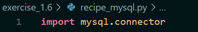

## Initialize Connection Object

Initialize a connection object called **conn**, which connects with the following parameters:

- Hostname is localhost
- Username is cf-python
- Password is password

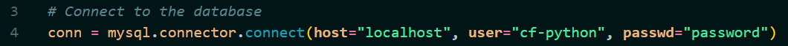

## Create a Cursor

Initialize a cursor object from conn.

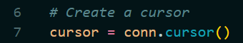

## Create a Database

Create a database called **task_database**

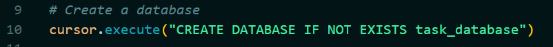

## Use the Database

Have your script access your database with the `USE` statement.

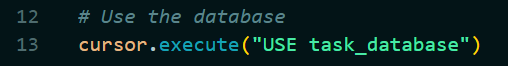

## Create a Table

Create a table called **Recipes** with the following columns:

- id: integer type; increments automatically; the primary key for this table.
- name: string type; character limit of 50; stores the name of the recipe.
- ingredients: string type; character limit of 255; stores the ingredients of the recipe in the form of a string.
- cooking_time: integer type; stores the cooking time in minutes.
- difficulty: string type; character limit of 20; stores the difficulty level as Easy, Medium, Intermediate, or Hard.

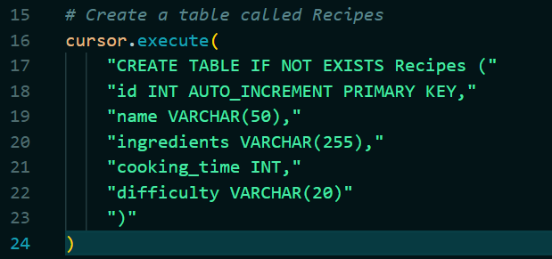

# Exercise 6 Part 2

## Table of Contents

1. [Create the Main Menu](#create-the-main-menu)

## Create the Main Menu

Define the function for the main menu

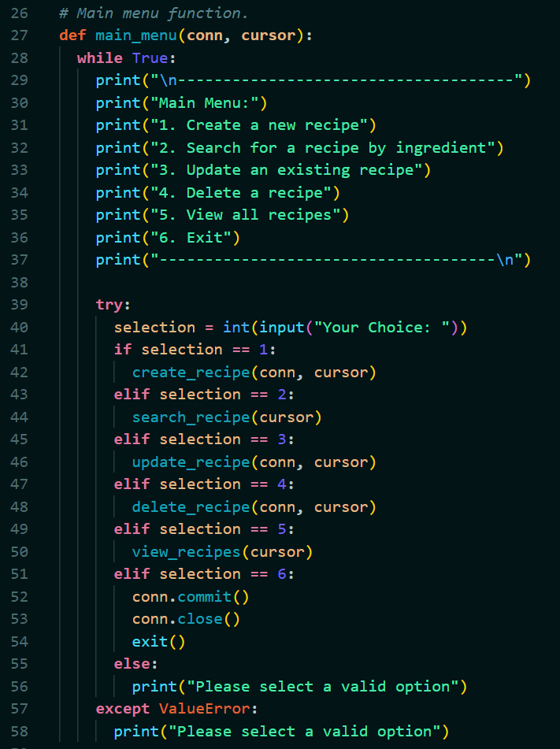

# Exercise 6 Part 3

## Table of Contents

1. [Start the Create Recipe Function](#start-the-create-recipe-function)
2. [Complete the Create Recipe Function](#complete-the-create-recipe-function)
3. [Create SQL Query](#create-sql-query)

## Start the Create Recipe Function

Collect the following details for a recipe entry:

- name: Name of the recipe, string type.
- cooking_time: Cooking time of the recipe in minutes, integer type.
- ingredients: Ingredients of the recipe, each ingredient stored as a string in this list.


## Complete the Create Recipe Function

Call a function called calculate_difficulty(). It calculates the difficulty of the recipe by taking in cooking_time and ingredients as its arguments, and returning one of the following strings: Easy, Medium, Intermediate, or Hard. Store the output in a variable called difficulty.

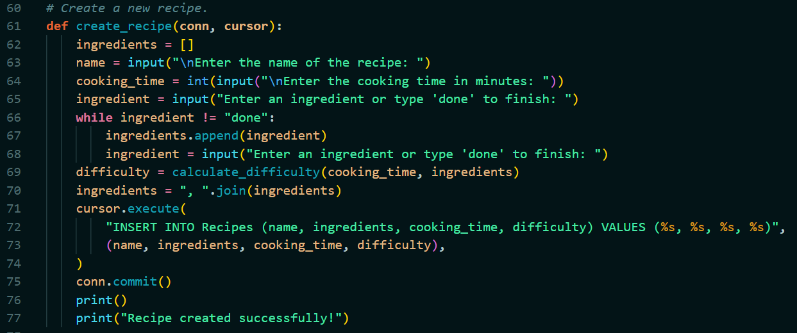

## Create SQL Query

Create a SQL query so that you can enter the recipe into the Recipes table on your database. Since MySQL doesn’t fully support arrays, your ingredients list needs to be converted into a comma-separated string.

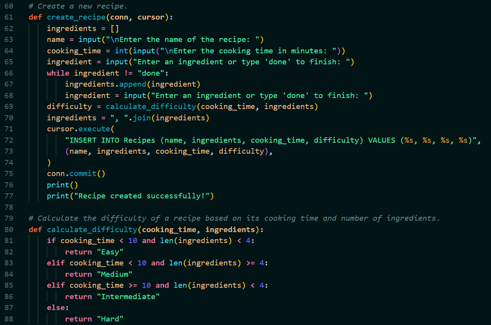

# Exercise 6 Part 4

## Table of Contents

1. [Start Defining the Search Recipe Function](#start-defining-the-search-recipe-function)
2. [Add Ingredients to All Ingredients](#add-ingredients-to-all-ingredients)
3. [User Selection](#user-selection)
4. [SQL Query Recipe Search](#sql-query-recipe-search)

## Start Defining the Search Recipe Function

You need to begin with an entire list of ingredients that is available in the Recipes table for the user to choose from. Obtain this list by SELECT-ing only the ingredients column from your table. Store the output into a variable called results.

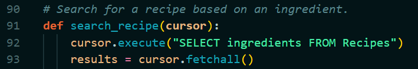

## Add Ingredients to All Ingredients

Add each ingredient that you come across into a new list called all_ingredients, and make sure that there are no duplicates.

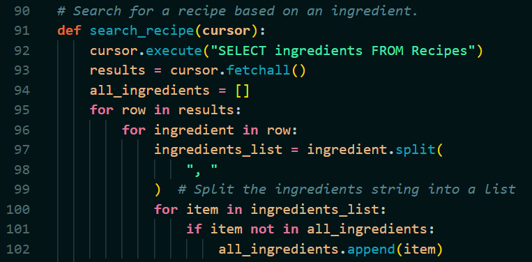

## User Selection

Display all ingredients that have been found to the user and allow them to pick a number corresponding to the ingredient in order to begin a search. Store the ingredient to be searched for into a variable called `search_ingredient`

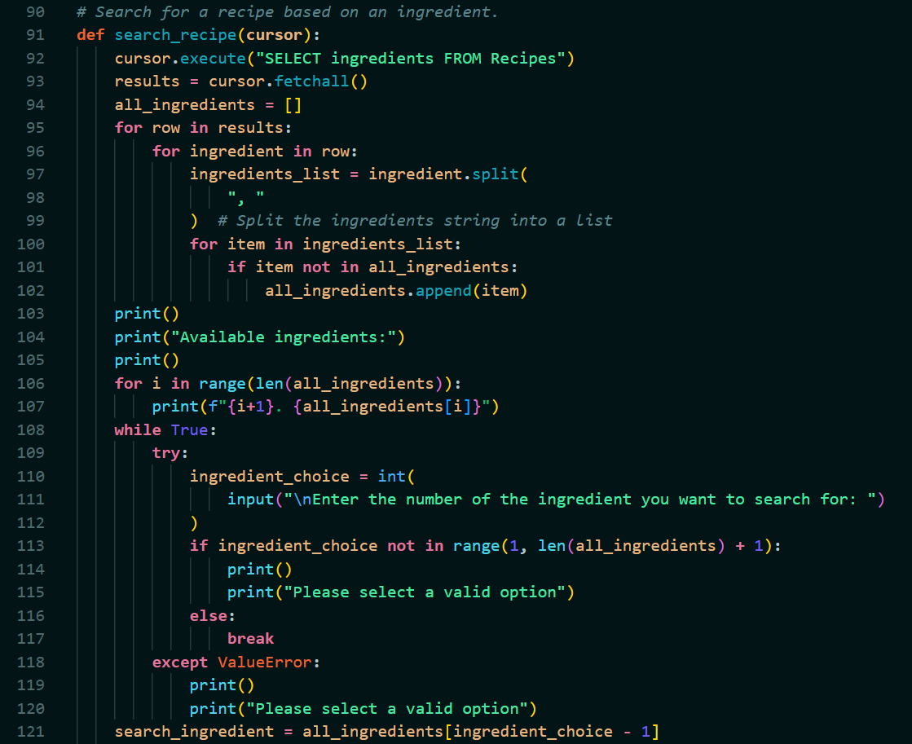

## SQL Query Recipe Search

Another SQL query is executed using the retrieved ingredient to search for recipes that contain that ingredient. The query uses the `LIKE` and `%` operators

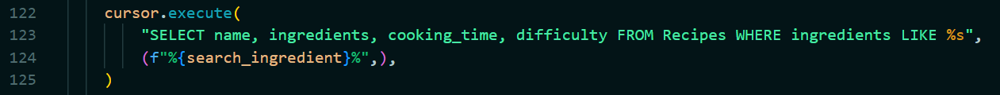

# Exercise 6 Part 5

## Table of Contents

1. [Start Defining the Update Recipe Function](#start-defining-the-update-recipe-function)
2. [Collect the New Value From User](#collect-the-new-value-from-user)
3. [Build Queries](#build-queries)
4. [Execute Queries and Commit Changes](#execute-queries-and-commit-changes)

## Start Defining the Update Recipe Function

Fetch all the recipes that are present on the database and list them to the user. The user will then pick a recipe to be updated by specifying its corresponding id, after which the script will ask for the column to be updated for that recipe. The columns available for modification are name, cooking_time and ingredients.

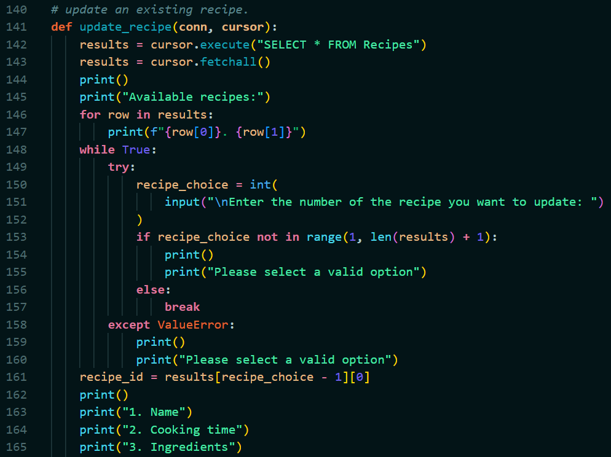

## Collect the New Value From User

Once the user selects the column that needs an update, collect the new value from the user.


## Build Queries

Build your query in the form of a string, to update an entry on the table for the given id, column, and updated value. Note that if the user is updating either cooking_time or ingredients, the script will have to recalculate the difficulty of the recipe, then update that column as well (make a separate query for this).

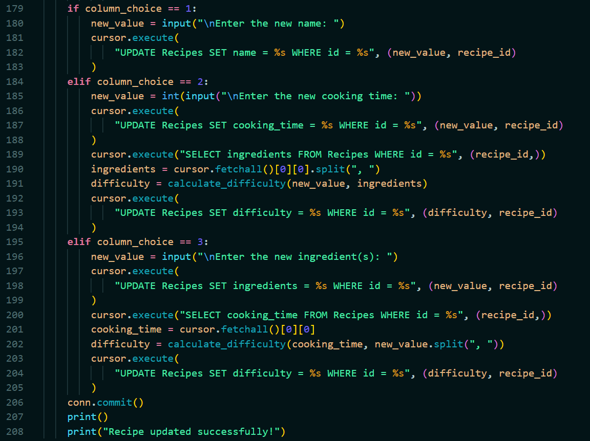

## Execute Queries and Commit Changes

Execute this query and commit your changes to the table.


# Exercise 6 Part 6

## Table of Contents

1. [Start Defining the Delete Recipe Function](#start-defining-the-delete-recipe-function)
2. [Build Query](#build-query)
3. [Execute Query and Commit Changes](#execute-query-and-commit-changes)

## Start Defining the Delete Recipe Function

This function will display every recipe in your table to the user, where they can pick one by its id for deletion.

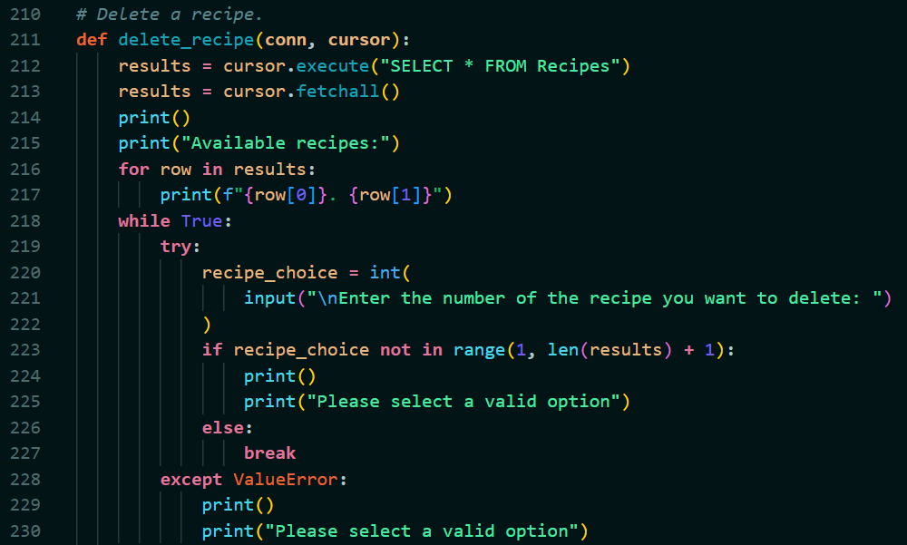

## Build Query

Build a query using the DELETE statement, where the row to be deleted is identified by the id that the user had specified.

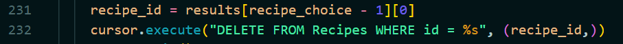

## Execute Query and Commit Changes

Execute Query and Commit Changes

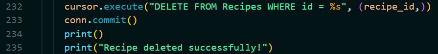

# Exercise 6 Part 7

## Table of Contents

1. [Run Script](#run-script)
2. [Add Recipes](#add-recipes)
3. [Run a Search](#run-a-search)
4. [Update a Recipe](#update-a-recipe)
5. [Delete a Recipe](#delete-a-recipe)
6. [Exit](#exit)

## Run Script

Ensure that your MySQL server is running on your system. Then, run your script.

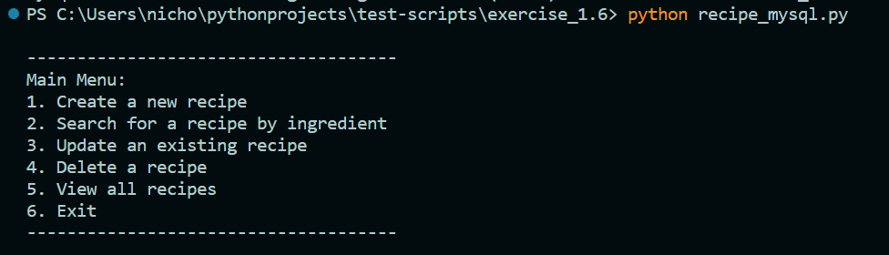

## Add Recipes

Create about 3 to 4 simple recipes of your choice using the first option in your menu.

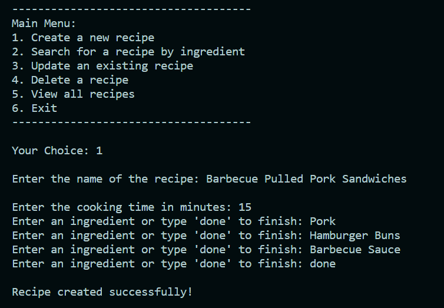

## Run a Search

Run a search by selecting the ingredient to search for, this time using the second option in the script: **Search for a Recipe**.

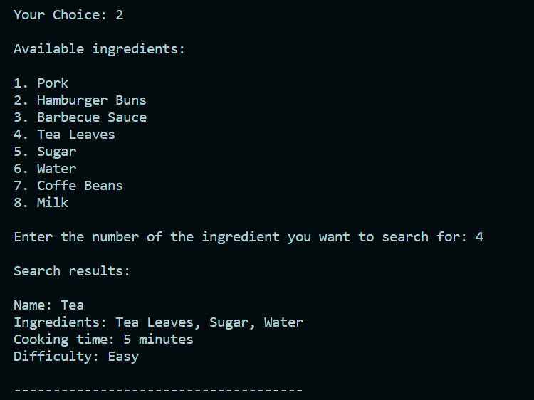

## Update a Recipe

Change a few values in some of your recipes using the third option in your script’s menu: Update a Recipe.

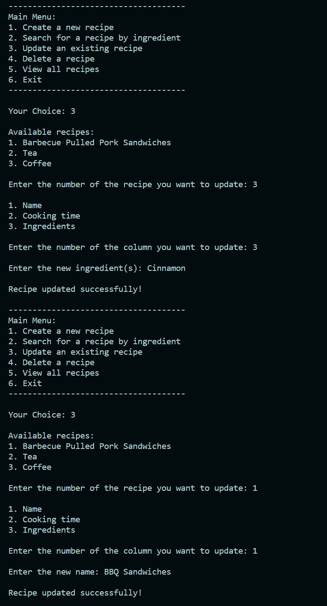

## Delete a Recipe

Delete a Recipe

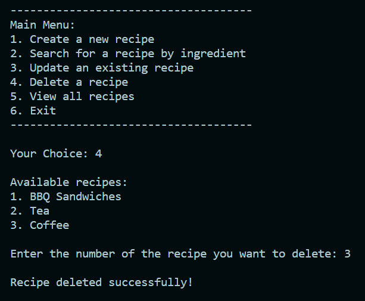

## Exit

Exit the Script
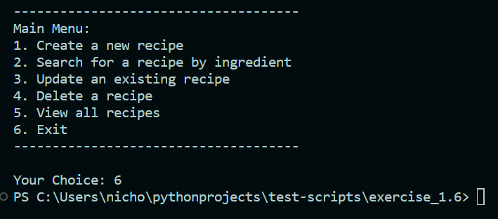